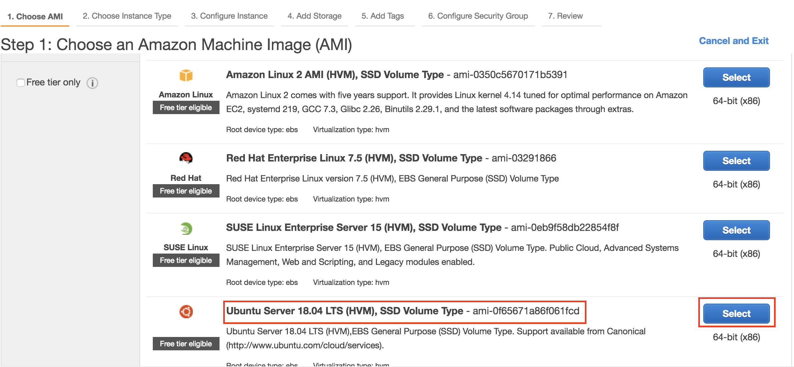
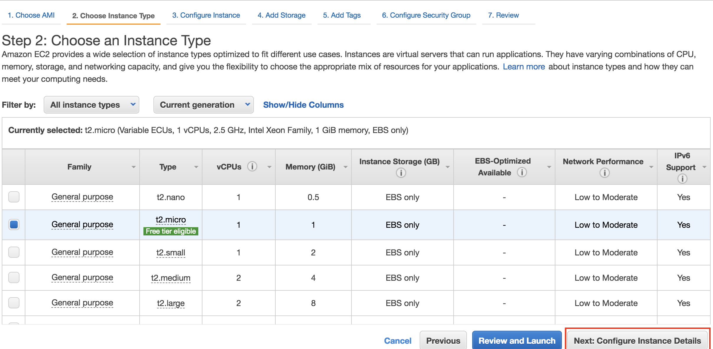
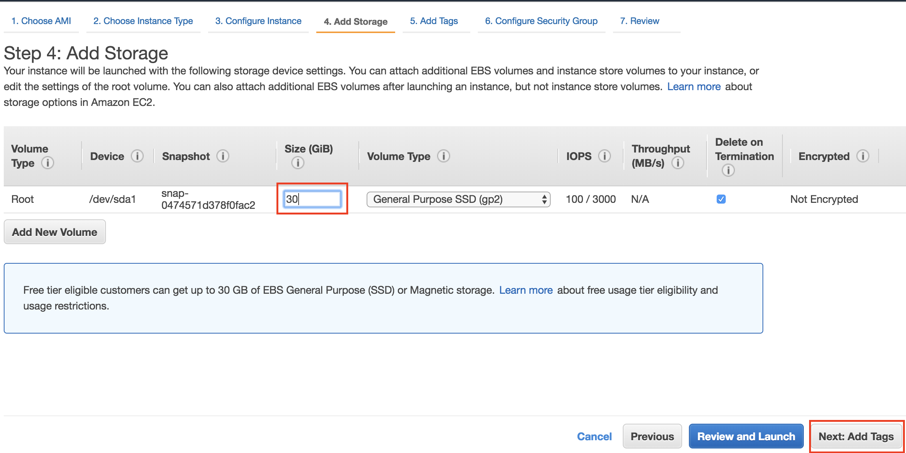
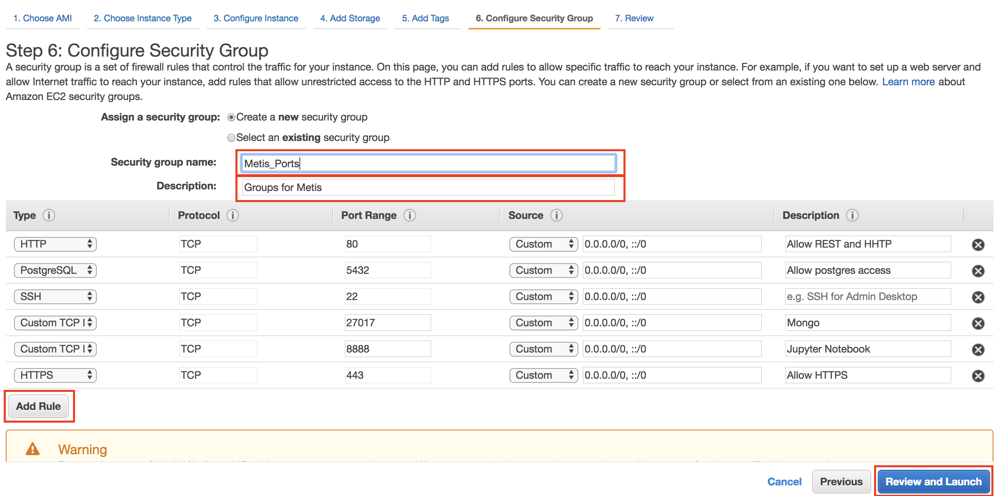
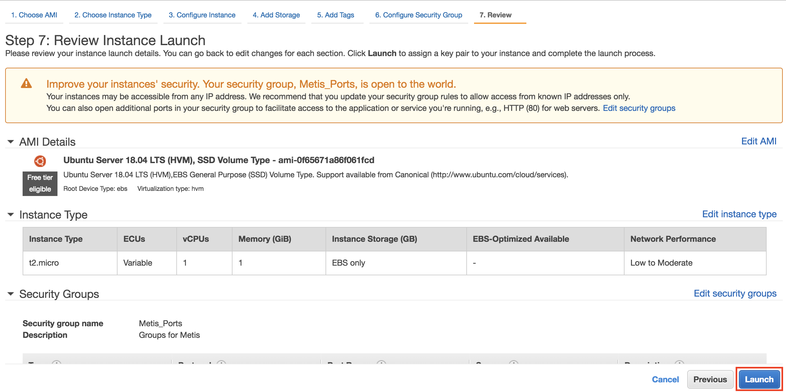
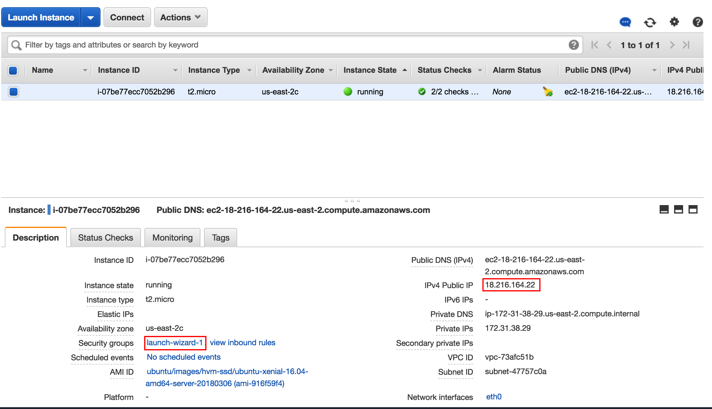
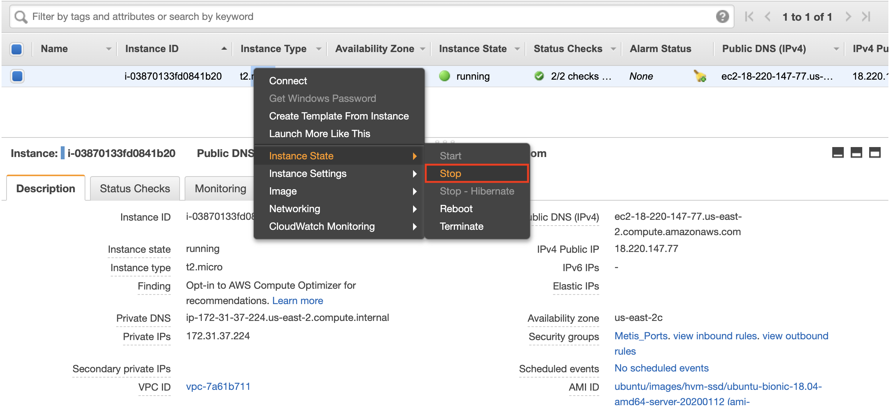

# Amazon Web Services
## Setting up Cloud Computing :cloud: :cloud: :cloud:

1.  Logging in  
  * http://aws.amazon.com/  
  * Note:  put your user id and password somewhere for easy reference
  * Note:  bookmark it!

2.  [AWS Free Tier](https://aws.amazon.com/free/)  
  * Credit card required for log-in
  * Designed to enable you to get hands-on experience with AWS Cloud Services
  * Includes services with a free tier available for 12 months following your AWS sign-up date, as well as additional service offers that do not automatically expire at the end of your 12 month AWS Free Tier term

3.  AWS Console  
  * Lot of options!  We will choose "Compute/EC2"  [upper left of screen]  
  * EC2 = Elastic Compute Cloud (Virtual Servers in the Cloud!)  

4.  Region [on upper right of screen]  
  * Select a region around your physical location
  * E.g. NYC would pick US East (N. Virginia)

5.  Create Instance  
  * From your EC2 Dashboard, click the blue **Launch Instance** button.

---

## Setting up Instance

1. Choose an Amazon Machine Image (AMI), (4th in list):  **Ubuntu Server** [press blue Select button]

  
2. Choose an Instance Type:  Select a **Free tier eligible** "t2.micro" instance

  

3. **Next: Configure Instance Details**  [accept default]  

4. **Next:  Add Storage**  [set to free max of 30GB]

  

5. Tag Instance. You can skip this part, and click "Next: Configure Security Group"

6. **Next:  Configure Security Group**  

  You should click "Add Rule" to add the following rules:

|Type| Protocol | Port Range | Source | Description (optional) |
|---|---|---|---|---|
| HTTP | TCP | 80 | My IP | Allow REST and HTTP |
| PostgreSQL | TCP | 5432 | My IP | Allow remote access to postgres |
| SSH | TCP | 22 | My IP | Allow remote SSH access |
| Custom TCP | TCP | 27017 | My IP | MongoDB |
| Custom TCP  | TCP | 8888 | My IP | Jupyter Notebooks |
| HTTPS | TCP | 443 | My IP | Allow https connections |

  We won't use all these ports immediately, but it is easy to setup the ports we will need. 
  By setting each rule's Source to "My IP", you are allowing your current local IP to access these specific ports within your EC2 instance.
  Note that if you ever switch wifi networks, you will have to update these rules to reflect your new IP.

  Give the security group a memorable name such as "Metis_Ports"
  Your network panel should look like this:

  

7. Review Instance Launch: your set-up will look like below screenshot  


  Click **Launch**  

---

## Set up Secure Access  

1.  Choose to "Create a new key pair" and give it a name:  **aws_key**  
2.  Download keypair

---

### Keypair
Having this pem file on your local computer allows you to securely ssh into your ec2 instance (note that aws pem public/private key pairs are just a special case of the encryption key pairs that are generally used to secure ssh connections).
Save file to your Downloads folder (`~/Downloads` on OSX).

Move your file to `~/.ssh/`.  (Note:  if you do not have an ssh folder, create one:  `mkdir ~/.ssh`)  
```bash
mkdir ~/.ssh
mv ~/Downloads/aws_key.pem ~/.ssh/aws_key.pem
```

Check to see the file exists in the directory with `ls -la *aws_key*`
```bash
cd ~/.ssh
$ ls -al *aws_key*
  -rw-r--r--@ 1   1692 Apr 23 14:46 aws_key.pem
```

Make your file read only with `chmod 400 filename`
```
chmod 400 aws_key.pem
ls -la *aws_key*
  -r--------@ 1   1692 Apr 23 14:46 aws_key.pem
```  
Notice how the permissions have been updated!

---

## Connecting to your Instance  
### AWS:  
**Click Big Launch Instance Button**

### Set Up Billing Alerts (Optional)
1. Update your billing preferences to enable billing alerts by going to your account name on top right corner > **My Billing Dashboard** > **Billing Preferences**. 
Check all 3 preferences and select **Save preferences**.  
Note: After you enable billing alerts for the first time, it takes about 15 minutes before you can view billing data and set billing alarms.
2. Set up billing alerts by following instructions [here](https://docs.aws.amazon.com/AmazonCloudWatch/latest/monitoring/monitor_estimated_charges_with_cloudwatch.html#creating_billing_alarm_with_wizard).

### Get the public IP

On your EC2 Dashboard, you'll soon be able to find the **public** IP address of your new cloud computer!



Do **not** use the private IP address.
**Note:  It may take a few minutes for the instance to initialize.**

### On Your Local Machine: using IP address

1. Open a new terminal window.

  **YOU MUST OPEN A NEW WINDOW**
  
    
2. Type the following command (the starting directory doesn't matter)
```bash
$ ssh -i ~/.ssh/aws_key.pem ubuntu@<my_public_ip>
```
  For example, to log onto the instance on the screenshot above, I would use `ssh -i ~/.ssh/aws_key.pem ubuntu@18.216.164.22`

  The first time you connect to a new IP address, you will be asked if you are sure you want to connect. Enter `Y` to log in.

  If you are successful, you should get the prompt
  ```bash
  ubuntu@ip-172-31-38-29:~$
  ```
  telling you that you are logged in as user `ubuntu` onto your AWS instance.

**Note:** You need your _public ip_ to log in (in this case `18.216.164.22`) but the prompt in the terminal will include the _private ip_ address (in this case `172.31.38.29`).

### On your local machine: using the config file (OPTIONAL)

You can link the identity key (`aws_key.pem`) and public IP address to a simple to remember name. We will use `myaws`.

1. Open your `config` file
```sh
vim ~/.ssh/config
```

2. Modify the file to be
```sh
Host myaws
        HostName 18.216.164.22 # use your IP instead
        User ubuntu
        IdentityFile ~/.ssh/aws_key.pem
```

  You should use _your_ public IP instead of `18.216.164.22`. Then save and exit the file (<kbd>ESC</kbd>` :wq`).


You can check if this worked by trying
```sh
ssh ubuntu@myaws
```
in the terminal. If successful, you should be connected to your AWS instance.

Note: The instance's IP address will change every time you stop and restart it, so you'll need to update this config file each time. Alternatively, you can follow the
optional instructions [here](optional_keeping_a_public_ip.md) to reserve a persistent IP address.

#### To exit Ubuntu machine (AWS cloud machine)  

```bash
exit
```  

>Example:  
```bash
ubuntu@ip-172-31-38-29:~$ exit
logout
Connection to 18.216.164.22 closed.
```

If you won't be using your EC2 instance for a while, stop the running instance by right clicking on the instance > Instance State > Stop.
This will prevent your EC2 instance from incurring hours while it's sitting idle. To start the instance back up again, 
follow the same steps and click Start instead of Stop. Recall that the instance's public IP address will change with each time, 
so make note of the new IP with each restart.

  
