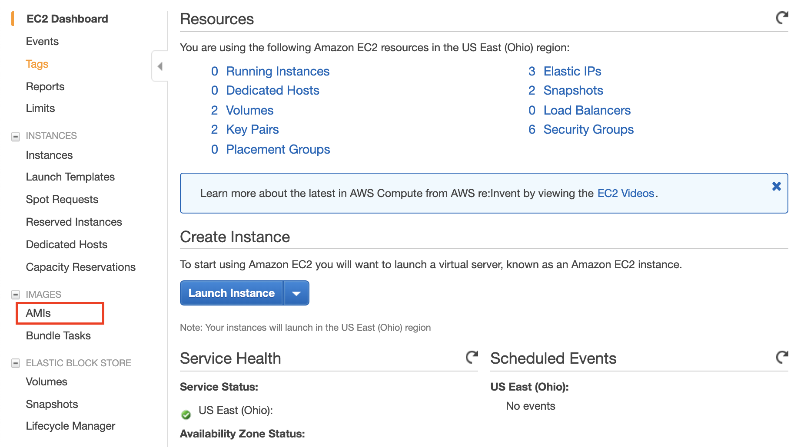
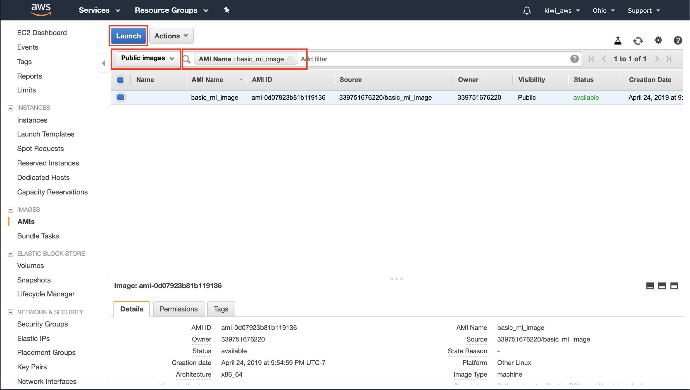
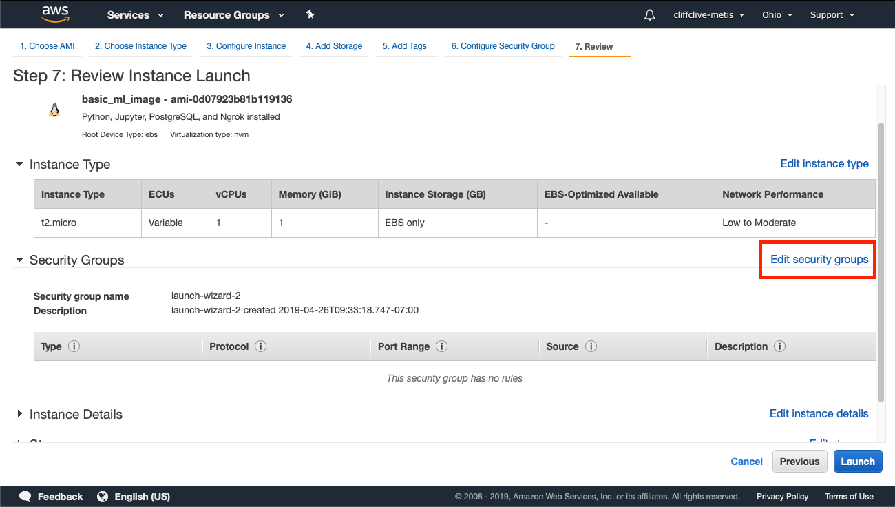

# Recreating an instance

If you need to create an instance from scratch, it is annoying to have to follow these steps every time. For example, if you discovered you needed more RAM or more processors (i.e. change from a `t2.micro` to a different processor), you would need to create a new instance.

Amazon allows us to save _images_, which are preconfigured instances. Here we will show you how to launch an image which has

* Anaconda Python installed
* The Metis environment (for projects 1-3)
* PostgreSQL (as well as the changes to the config files)
* The `ngrok` program for SSH tunneling.

## Setting up the instance

1. Go to https://aws.amazon.com
2. On the left-hand navigation panel, click on `AMI` under Images
   
3. On the AMI page:
   - Select "public instances" from the drop down
   - In the text box, write `AMI Name: basic_ml_image`
   - Once the image appears, select it
   - Then click "Launch"
   
4. You will then be taken through the steps of selecting a processor and storage. The defaults should be fine, but if you want to change from a `t2.micro` to a more powerful processor, you can do it on this step. The only thing you should change are the _security groups_; change this to **Metis_Ports** (or whichever name you used when setting up AWS originally)
   

When you log on to this new instance, the software we use will already be installed.  
