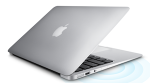

# Computer Requirements

If you are taking a Metis bootcamp or short immersive course, it's critical that you have a computer that's up for the job. Data processing can be demanding on computational resources, especially when large-scale datasets and machine learning are involved (as they often are in our courses!). It's also important to know that we **strongly recommend using a mac for Metis courses**. Beyond just resource requirements, mac operating systems make it much easier to be an active programmer and to manage the package installation/configuration required by our courses.

Please **check your computer specs against our recommendations in Section 1**, and **read section 2 if considering a choice of (new) machine**.   

[Section 1. Computer Specs](#section-a)  
[Section 2. Mac vs Windows](#section-b)  

---

## 1.  Computer Specs

You will need a laptop or desktop that has access to a Unix operating system (Mac or Ubuntu) with *at least these minimum* specs:
- Memory: at least 8GB RAM
- Processor: at least 2GHz
- Storage: at least 100 GB HD

### Notes
- **Chromebooks** are not adequate for use in the bootcamp
- **Windows 10** can optionally run Ubuntu simultaneously. However, this option is currently **not recommended** as there are subtle differences between this setup, which simultaneously runs both operating systems, and a virtual machine or a dual boot system. If you choose to try it, be warned that instructors may not be able to assist you and you may need to switch to a real virtual machine if problems persist. 

---

## 2.  Mac vs Windows

### Case for Mac over Windows

**Most people use Macs. They *are* expensive, but they work really well and they have a Linux-similar operating system that lets you just get down to business. That way, you can spend more time on data science and less time troubleshooting.**  

**Metis immersive courses are intense. Spending time wrestling with compatibility issues has a high opportunity cost.**  

Many Windows users aren’t used to using their computers in the full range of ways that are necessary. In summary, we find that things are more difficult to set up on Windows, and Windows users are often less comfortable setting up even simple things. This common combination leads to large productivity hurdles and possible setbacks to class progress when everyone has to wait for a Windows user to get individual help. On top of this, it's common for productive data scientists to not use Windows, and in particular the instructional staff at Metis **does not** and **should not** spend their time troubleshooting Windows issues.

Specific Examples (of what's more difficult on Windows):
* Setting PATH
* Installing common packages
* Installing a compiler toolchain
* Accessing compressed files
* Downloading remote files
* Using X windows
* Writing shell scripts
* Scheduling tasks

Windows is discouraged, but some people are actually productive on Windows, especially if you have extensive experience with the operating system as a programmer. If you really want to run Windows, maybe you should. But we don’t like to put students in a position where we can’t help them, and **we don’t support Windows.**

If you want to spend time learning how to configure things, we recommend learning how to configure Linux over learning how to configure Windows.

### Running Windows - Don't Do It

**Q:  Can I run Windows for the bootcamp, instead of Unix or Linux?**  
A: The short answer is this: **Don't run Windows.**

The slightly longer answer is that it is possible to run Windows, but everything is harder. We've had many students start a course with Windows, but typically these students soon buy a new computer because it's too hard to keep up in Windows.

### If not Mac, if not Windows, then ---> Linux

You don't necessarily need to buy a new computer. Here are some alternatives:

 * **Linux Virtual Machine:**  If your computer is fairly powerful, you could run a Linux Virtual Machine inside your normal Windows install. This requires some configuration, but at least you end up with a working Linux machine instead of having to try to make Windows do things.
 * **Install Linux on your computer instead of or alongside Windows:**  Then you can boot to Linux instead of booting to Windows. Again, there is a good deal of configuration to be done to get this to work well, in general. We've had a small number of students do a course with Linux this way.
 * **EC2:**  You could `ssh` into a remote Linux machine on EC2 and do all your work there. This requires some setup but perhaps less than the above two options. You'll mostly forgo a graphical interface, most likely, and you'll be paying for your computing by the hour.
 * **Git Bash:** You could use git-bash and/or other tools to try to make Windows achieve the functionality of Linux/MacOS. This becomes frustrating pretty frequently and may limit the tools you can use.

### Which type of Linux?

So you've decided to install Linux on your computer or in a virtual machine? Which kind should you install?

If you have limited experience with Linux (i.e. if you have to ask the question about which kind of Linux to install), then you should **install Ubuntu.** There are quirks to each version of Linux, so it's best to choose something that the instructors and TAs are familiar with.

If you have a lot of familiarity with Linux (say > 1 year), then you may install whatever kind you are most familiar with. Recognize that the instructors may only be able to offer limited assistance if you do so.

