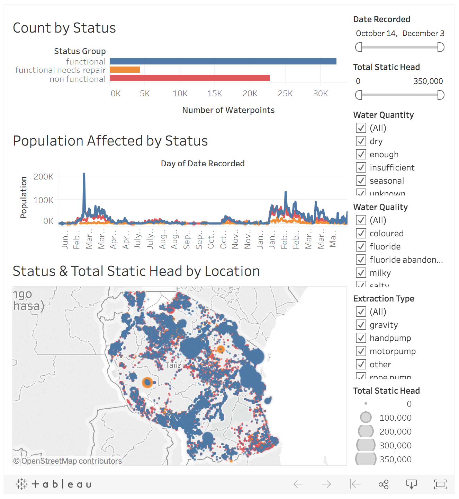

# Predicting the Functionality of Tanzania Waterpoints
Arjun Sudhir

## Abstract
The goal of this project was to use classification models to predict the operating condition of waterpoints in Tanzania in order to help improve operations and maintenance planning of these units. I worked with data provided by [Taarifa](http://taarifa.org/) and the Tanzanian Ministry of Water, leveraging geographic and categorical feature engineering along with a random forest model to achieve promising results for this multiclass problem. After refining a model, I built an interactive dashboard to visualize and communicate my results using Tableau.      

## Design
This project originates from the [DrivenData competition](https://www.drivendata.org/competitions/7/pump-it-up-data-mining-the-water-table/) "Pump it Up: Data Mining the Water Table". The data is provided by [Taarifa](http://taarifa.org/) and the Tanzanian Ministry of Water, and presents a three-class operational status of **functional**, **functional needs repair**, and **non-functional** for waterpoints across the country. Classifying statuses accurately via machine learning models would enable the Tanzanian Ministry of Water to take action to improve operations and maintenance planning of these units, allocate resources more quickly to needed areas, and ensure potable water is accessible to as many people as possible.

## Data
The dataset contains 59,400 waterpoints with 40 features for each, 32 of which are categorical. A few feature highlights include measurements of water quantity and quality, pump types, and latitude/longitude coordinates. Nearly a third of the individual features could be grouped into more general categories, and an in-depth analysis of 20 of them was undertaken to inform baseline models and feature engineering. 

## Algorithms

*Feature Engineering*
1. Mapping latitude and longitude to 3-dimensional coordinates so nearby continuous values would also be close in reality
2. Converting categorical features to binary dummy variables
3. Combining particular dummies and ranges of numeric features to highlight strong signals and illogical values for waterpoint status identified during EDA
4. Selecting subsets of the total unique values for categorical features that were converted to dummies, according to the number of samples they were associated with and their contribution to certain statuses

*Models*
  
Logistic regression, k-nearest neighbors, and random forest classifiers were used before settling on random forest as the model with strongest cross-validation performance. Random forest feature importance ranking was used directly to guide the choice and order of variables to be included as the model underwent refinement.

*Model Evaluation and Selection*
  
The entire training dataset of 59,400 records was split into 80/20 train vs. holdout, and all scores reported below were calculated with 5-fold cross validation on the training portion only. Predictions on the 20% holdout were limited to the very end, so this split was only used and scores seen just once.

The official metric for DrivenData was classification rate (accuracy); however, class weights were included to improve performance against F1 score and provide a more useful real-world application where classification of the minority class (functional needs repair) would be essential.

**Final random forest 5-fold CV scores:** 99 features (7 numeric) with class weights
   - Accuracy 0.797
   - F1 0.791 micro, 0.679 macro
   - precision 0.792 micro, 0.722 macro
   - recall 0.797 micro, 0.658 macro

**Holdout** 
   - Accuracy: 0.802  
   - F1: 0.795 micro, 0.685 macro  
   - Precision: 0.796 micro, 0.725 macro  
   - Recall: 0.802 micro, 0.664 macro

## Tools
- Numpy and Pandas for data manipulation
- Scikit-learn for modeling
- Matplotlib and Seaborn for plotting
- Tableau for interactive visualizations

## Communication
In addition to the slides and visuals presented, [Tanzania Waterpoints](https://public.tableau.com/profile/arjun#!/vizhome/TanzaniaWater/TanzaniaWaterpoints) will be embedded on my personal website and blog.

